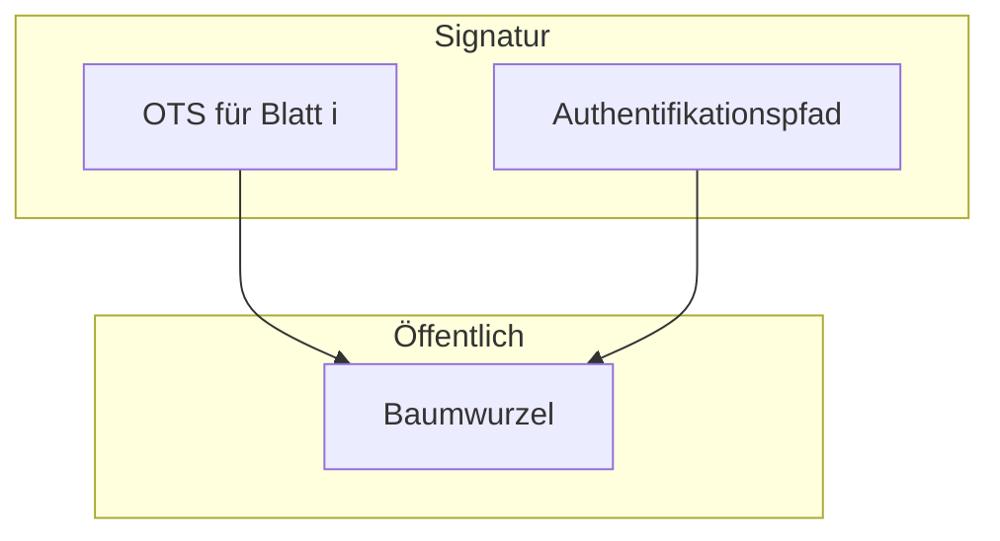

# Phase B — Theorie: Ausformulierung nach Gliederung (Arbeitsfassung)

Dieses Dokument ist die **inhaltliche Erstfassung** für die Kapitel aus **[OUTLINE.md](OUTLINE.md)** (Schwerpunkte Kapitel 2–6 und Kurz-Fazit). Die **Einleitung** und die **Norm-Kurzfassungen** liegen in **[PHASE_A_EINLEITUNG_UND_RECHERCHE.md](PHASE_A_EINLEITUNG_UND_RECHERCHE.md)** — hier wird **vertieft** und **verdichtet**, ohne die Primärquellen (SP 800-208, RFC 8391) zu ersetzen: für die Abgabe **Zitate und Seitenangaben** aus den Originaldokumenten ergänzen.

**Hinweis Umfang:** Die finale **PDF-Dokumentation** ist bei Code auf **max. 10 Seiten** begrenzt — dieser Text ist bewusst **länger** und dient als **Materialvorrat** zum Kürzen und Verschieben von Details in die Präsentation.

---

## Kapitel 2 — Überblick: Digitale Signaturen und Post-Quantum-Kryptografie

### 2.1 Funktion digitaler Signaturen

Digitale Signaturen erfüllen typischerweise **Integrität** (die Nachricht wurde nicht unbemerkt verändert) und **Authentizität** (ein bestimmter Inhaber eines privaten Schlüssels hat signiert). Anders als bei reinen MACs ist die Überprüfung mit einem **öffentlichen** Schlüssel möglich; dadurch eignen sich Signaturen für verteilte Szenarien (Software-Updates, Zertifikate, Dokumente).

### 2.2 Klassische und moderne Familien (kurz)

- **Klassisch** (RSA, DSA, ECDSA): Sicherheit basiert auf Problemen wie Faktorisierung oder diskretem Logarithmus; die **Quantencomputer-Diskussion** motiviert den Ersatz durch PQC-Verfahren.
- **Post-Quantum-Kryptografie (PQC)** umfasst mehrere Konstruktionsfamilien: **gitterbasiert**, **codebasiert**, **multivariat**, **hashbasiert** und andere. Für Signaturen sind u. a. **gitterbasierte** Verfahren (z. B. ML-DSA) und **hashbasierte** Verfahren (z. B. SLH-DSA bzw. SPHINCS+, XMSS, LMS) standardisiert bzw. normiert.

### 2.3 Rolle von Hashfunktionen

In hashbasierten Signaturschemata sind **kryptographische Hashfunktionen** zentral: Sie verdichten Daten auf feste Längen und liefern die Bausteine für Ketten und Bäume (siehe Kapitel 3). Die Sicherheitsannahmen (Urkundenresistenz, Angriffsmodell) sind in den jeweiligen **Beweisen und Spezifikationen** (RFC 8391, SP 800-208) präzise — für diese Arbeit genügt die Einordnung: **Sicherheit hängt von der korrekten Implementierung der Hashaufrufe und des Zustands** ab.

### 2.4 Warum hashbasierte Signaturen eine eigene Nische haben

Hashbasierte Konstruktionen gelten als **konservativ**: Die Argumentation stützt sich auf gut studierte Hashannahmen; zugleich sind **stateful** Varianten (XMSS, LMS) **betrieblich anspruchsvoll**, weil sie einen **fortschreibenden geheimen Zustand** erfordern — genau dieses Spannungsfeld ist das Thema der Arbeit.

---

## Kapitel 3 — Einmal-Signaturen und Merkle: Von der Idee zu XMSS

### 3.1 Einmal-Signaturen (OTS)

Bei einer **Einmal-Signatur** darf aus einem gegebenen geheimen Schlüsselmaterial nur **eine** Signatur unter einer Nachricht erzeugt werden (im vorgesehenen Sicherheitsmodell). Wird derselbe geheime Zustand **ein zweites Mal** verwendet, kann ein Angreifer unter typischen Annahmen **Schlüsselmaterial oder Fälschungen** ableiten. Diese Eigenschaft ist kein Implementierungsfehler, sondern **Definition** der OTS — sie erzwingt ein **Zählen** oder eine andere strikte Buchführung, welche „Einheit“ bereits verbraucht ist.

### 3.2 Winternitz und WOTS+ (intuitiv)

Der **Winternitz-Ansatz** kodiert Nachrichtenblöcke so, dass mehrere Bits pro Hashketten-Schritt verarbeitet werden — ein Kompromiss zwischen Signaturgröße und Rechenaufwand. **WOTS+** ist die in **XMSS** verwendete Variante mit angepassten Hashaufrufen und Maskierung; Details der Kettenbildung stehen in **RFC 8391** und sollten bei Bedarf dort mit Abbildung und Algorithmus nachgelesen werden.

### 3.3 Merkle-Bäume: viele OTS unter einem öffentlichen Schlüssel

Um **mehrere** Nachrichten mit einem **kompakten** öffentlichen Schlüssel zu signieren, werden viele OTS-Schlüsselpaare als **Blätter** eines binären Hashbaums (Merkle-Baum) organisiert. Die **Wurzel** des Baums wird Teil des öffentlichen Schlüssels. Eine Signatur enthält dann u. a.:

- die **OTS-Signatur** für das gewählte Blatt,
- den **Authentifikationspfad** (Geschwister-Hashes auf dem Pfad zur Wurzel),

sodass ein Verifizierer die Konsistenz bis zur **bekannten Wurzel** prüfen kann.

### 3.4 Index und Zustand

Jedes Blatt hat eine **Position** (Index). Der Signaturprozess muss **den nächsten freien Index** wählen und nach erfolgreicher Signatur sicherstellen, dass dieser Index **nicht erneut** verwendet wird — das ist der **Zustand** in algorithmischer Form. **XMSS** konkretisiert Baumaufbau, Parametrisierung und Datenformate (**RFC 8391**).

---

## Kapitel 4 — XMSS und Zustand: Spezifikation und Norm

### 4.1 RFC 8391 — Spezifikationsinhalt

**RFC 8391** definiert **XMSS** (ein Baum) und **XMSS^MT** (mehrere Ebenen von Bäumen für sehr große Signaturanzahlen) sowie **WOTS+**. Implementierer finden dort Byte-Layouts, Algorithmen und Parameter-Sets. Für die Arbeit ist wesentlich:

- Welche Daten **öffentlich** sind (u. a. Wurzel, Parameter),
- welche Daten **geheim** bleiben und wie der **Index** fortgeschrieben wird,
- dass die **Interoperabilität** von korrekter Kodierung und korrektem Zustand abhängt.

### 4.2 NIST SP 800-208 — Empfehlungen und Zustandsdisziplin

**SP 800-208** bündelt **NIST-Empfehlungen** für **stateful hashbasierte** Schemata, u. a. **LMS/HSS** und **XMSS/XMSS^MT**. Kerngedanke: Die **kryptographische Sicherheit** setzt voraus, dass der **private Zustand** (welche Einheiten verbraucht sind) **korrekt** geführt wird. Das Dokument benennt **genehmigte Parameter** (Hashfunktionen, Sicherheitslevel, Baumgrößen) und richtet sich an **Implementierer und Betreiber**.

**Konsequenz:** Dokumentation, **Backup-Konzepte**, Schutz vor **parallelem Signieren** mit veraltetem Zustand und ggf. Einsatz in **Hardware** (kryptographische Module) sind keine „Nice-to-haves“, sondern Teil der Sicherheitsbetrachtung.

### 4.3 Was „Zustand“ in der Implementierung bedeutet

Praktisch umfasst der Zustand mindestens:

- den **aktuellen Index** (nächste freie OTS-Instanz),
- ggf. **gecachte Baumknoten** zur effizienten Signaturerzeugung (verfahrensabhängig),
- Metadaten zur **Parametrisierung**.

**Persistenz:** Der Zustand muss nach jedem Signiervorgang **atomar** oder mit Wiederanlaufstrategie gespeichert werden — ein Absturz zwischen „Signatur erzeugt“ und „Index erhöht“ ist ein klassisches Fehlerfenster.

---

## Kapitel 5 — Operative Risiken: Backup, Zähler, Desynchronisation

### 5.1 Bedrohungsbild (prägnant)

| Risiko | Beschreibung |
|--------|----------------|
| **OTS-Wiederverwendung** | Zwei Signaturen nutzen dieselbe OTS-Einheit (gleicher Index zweimal) — bricht die vorgesehene Sicherheit. |
| **Veraltetes Backup** | Wiederherstellung eines Standes, in dem der Index **kleiner** ist als in der Realität — der Signaturgegenstand „denkt“, Blätter seien frei, die schon genutzt wurden. |
| **Mehrere Instanzen** | Zwei Server signieren mit **kopiertem** Schlüsselmaterial ohne gemeinsamen Zustand — Indexkollisionen möglich. |
| **Zustandsverlust** | Index-Datei korrupt; Wiederherstellung aus unklarem Backup ohne Audit. |

### 5.2 Typische Szenarien

1. **Nacht-Backup:** Der Signaturdienst hat nach dem Backup noch signiert; beim Restore vom Band ist der Zähler **zurück** — erneutes Signieren verwendet bereits verbrauchte OTS-Positionen.
2. **VM-Snapshot:** Ähnliches Problem wie Backup — der Zustand der VM ist älter als der des echten Dienstes.
3. **Klonen:** Image eines Servers mit privatem Schlüssel — beide Klone signieren ab demselben Index.

### 5.3 Abgrenzung zum Projekt-Code

Das Repository enthält eine **didaktische Lamport-OTS** (`stateful_signatures`): ein Einmal-Schlüssel mit Zustand „verbraucht“, **kein** XMSS nach RFC 8391 (kein Merkle, keine WOTS+). Es **illustriert** OTS-Wiederverwendung nach veraltetem Zustand — analog zum Zähler-/Backup-Problem bei XMSS. In der Ausarbeitung klar trennen: **Theorie/XMSS** vs. **Demo** — letztere dient der Anschauung, nicht dem kryptographischen Nachweis für produktive Systeme.

---

## Kapitel 6 — Lösungsrichtungen und Grenzen

### 6.1 Betrieb und Architektur

- **Zentrale Signatur:** Ein dedizierter Dienst hält den **einen** autoritativen Zustand; Clients senden nur Hashwerte. Reduziert verteilte Zustandskopien — erfordert Verfügbarkeit und Absicherung des Dienstes.
- **Hardware-Sicherheitsmodul (HSM):** Schlüssel exportieren nicht; Zustand kann im Modul geführt werden. **Kein** „Papier-Entwurf“ in dieser Arbeit — nur Einordnung: erhöhte Kosten, Zertifizierung, Betriebsprozesse.
- **Klare Backup-Politik:** Nur **konsistente** Paare aus geheimem Schlüsselmaterial und Zustand sichern; nach Restore **Audit** (maximaler Index, keine Dubletten). Ggf. **Cold Standby** statt aktiver Duplikate ohne Koordination.

### 6.2 Monitoring und Prozesse

Protokollierung: wer signiert, welcher Index, Zeitstempel; Alarme bei **Lücken** oder **Duplikaten** in der Indexfolge. Das ersetzt keine kryptographische Sicherheit, verbessert aber **Fehlererkennung**.

### 6.3 Grenzen des studentischen Demonstrators

Die bereitgestellte Software ist **minimal**, **nicht** side-channel-härt, **nicht** auditierbar im Sinne einer Produktionsfreigabe. Sie zeigt **ein** Aspekt (Lamport-OTS und simulierte Wiederherstellung eines „unbenutzt“-Zustands). Aussagen über reale XMSS-Deployments bleiben **literatur- und normgestützt**, nicht „weil die Demo schnell war“.

---

## Kapitel 7 — Fazit und Ausblick (Kurzfassung)

Stateful hashbasierte Signaturen (hier: **XMSS** als Spezifikationsanker) bieten **klar verstandene** kryptographische Grundlagen, stellen Betrieb und Infrastruktur aber vor die Aufgabe, **Zustand und Backup** so zu gestalten, dass **Einmaligkeit** der OTS-Einheiten gewahrt bleibt. Die Normen **RFC 8391** und **SP 800-208** liefern die fachliche Grundlage; die **operative** Seite (Desasterrecovery, Klonen, Multi-Instanz) entscheidet oft über die tatsächliche Sicherheit.

Für die **Präsentation** eignet sich ein durchgängiges **Szenario** (Restore alter Zustand → Konsequenz); die **Demo** im Repository kann das **narrativ** unterstützen, muss aber **beschriftet** bleiben als Lehr-Modell.

---

## Bezug zu Meilensteinen (Projektplan)

| Meilenstein | Abgedeckt in Phase B (inhaltlich) |
|-------------|-----------------------------------|
| **M2** Erstfassung „Stateful / XMSS / Zustand“ | Kapitel 3–4 |
| **M3** „Backup & Zähler“ mit Bedrohungsbild | Kapitel 5 |
| Vorbereitung **M4** (Theorie ↔ Demo) | Kapitel 5.3 und 6.3; Umsetzung in Phase D/C |

---

## Nächste Schritte (Phase C–F)

- **Phase C:** **[PHASE_C_TECHNIK.md](PHASE_C_TECHNIK.md)** — Demo/Benchmark.
- **Phase D:** **[PHASE_D_INTEGRATION.md](PHASE_D_INTEGRATION.md)** — Theorie ↔ Demo verzahnen, Grenzen.
- **Phase E/F:** Präsentation; finale PDF; Abbildungen aus SP 800-208/RFC **mit Quellenangabe** — keine Abbildungen ohne Nachweis.
